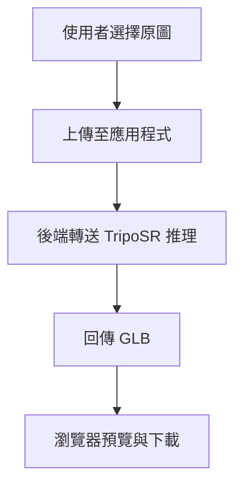

# TripoSR 整合：單步原圖轉 3D

## Problem Frame

`life-course-from-2d-to-3d` 目前 **去背為真實 rembg**，**2D→3D 仍為 mock GLB**（見 `backend/app/main.py` 註解）。團隊希望改以 **TripoSR**（參考 `TripoSR-main/run.py` 與 `gradio_app.py` 所代表的推理管線）產出真實網格，並重新對齊產品敘事：**使用者上傳原圖後單步取得 3D**，去背與前處理由 TripoSR 側流程承擔，而非現有「先去背預覽、再轉 3D」兩段式產品。

本文件取代先前 brainstorm 中與「兩步驟去背＋3D」「獨立去背 API」相衝突的產品假設（見 `docs/brainstorms/2026-03-30-rewrite-bg-removal-and-3d-requirements.md`）；實作遷移時應以本文件為準。

## User Flow

## Requirements

**產品與使用者流程**

- R1. 主流程為 **單一步驟**：使用者上傳 **原圖**（支援格式於規劃階段對齊驗證規則），取得可預覽與下載的 **3D 模型**。
- R2. **不再提供**以「先去背、再手動觸發 3D」為核心的產品路徑：前端移除兩步驟主敘事與相關 CTA。
- R3. **預設輸出格式為 GLB**，以便沿用 `<model-viewer>` 預覽與下載；**不提供**使用者於首版在 UI 上選擇 OBJ／GLB（OBJ 可作為後續進階下載，非本文件範圍）。

**後端能力**

- R4. `/api/image-to-3d`（或語意等同的單一入口）須回傳 **真實 TripoSR 產出之 GLB**，取代 mock。
- R5. **移除**獨立 **`/api/remove-background`** 及其啟動時 rembg session 載入（與 R2、R1 一致）；健康檢查／就緒語意需改為反映 **3D 推理服務** 是否可用（細節於規劃階段定義）。
- R6. 上傳驗證首版 **收斂為 PNG + JPEG**（含大小上限與 magic bytes 檢測）；精確 MIME、錯誤訊息與 WebP 是否於後續版本開放，於規劃階段對齊 TripoSR 實測。

**參考實作（非規格複製）**

- R7. TripoSR 行為以 `TripoSR-main` 中 **單圖推理 → 匯出 mesh** 的路徑為準；`run.py` 與 `gradio_app.py` 為理解參照，**不要求**整合 Gradio 或保留 CLI 於產品路徑中。

## Success Criteria

- 使用者僅上傳原圖即可在瀏覽器中看到 **非空**、可旋轉的 3D 預覽，並可下載 GLB。
- 產品介面不再依賴「去背預覽步驟」作為完成轉換的前置條件。
- 後端不再暴露獨立去背 HTTP API（與 R5 一致）。

## Scope Boundaries

- 首版 **不提供** OBJ／多格式選擇器於前端。
- **不**將 `TripoSR-main/gradio_app.py` 整體嵌入為正式 UI。
- 部署拓樸（單容器 vs compose vs 雲端 GPU）於本文件僅記 **建議方向**，細部於規劃決定。

## Key Decisions

- **單步原圖 → 3D**：去背與 TripoSR 前處理由 TripoSR 管線負責，簡化使用者心智負擔。
- **收斂 rembg 服務**：移除獨立去背 API 與相關啟動邏輯，避免與 TripoSR 內建去背 **重複** 且產品路徑分裂。
- **預設輸出 GLB**：與現有 `<model-viewer>` 技術選型一致，降低前端改動面。
- **建議實作拓樸（非最終）**：TripoSR 推理與輕量 API **分離為獨立 GPU 服務或 worker**，`life-course` 後端負責驗證與轉送；先以本機驗證產物品質再收斂部署。

## Dependencies / Assumptions

- TripoSR 在目標執行環境具 **可接受的推理延遲與 GPU／記憶體** 條件；否則需調整 UX（非同步任務、佇列）——見下方 Deferred。
- **延遲假設（2026-04-15 對齊）**：主要場景下，從使用者提交到可預覽 GLB **大多 < 30 秒**，首版可採 **單次同步請求 + 全畫面等待**，不強制 job 佇列；若實測常態超標，應回到本文件升級 UX 假設。
- 輸入圖片類別與解析度上限須與 TripoSR 穩定運作範圍對齊（於規劃階段驗證）。

### Grill-me 已定案（索引）

實作層面的細部決策（服務邊界、逾時、併發、EXIF、隱私、錯誤 id、空網格門檻等）已於 **`docs/plans/2026-04-15-001-feat-triposr-single-step-plan.md`** 內 **`## Grill-me 已定案（2026-04-15）`** 收斂；需求稿本節不逐條重複，以免雙處維護漂移。

## Outstanding Questions

### Resolve Before Planning

- （無）— 關鍵產品分叉已於 brainstorm 收斂。

### Deferred to Planning

- [影響 R4][技術] TripoSR 服務的 **行程邊界與 API 契約**（同步回傳 vs 非同步 job id、逾時、重試）。
- [影響 R6][技術] 將既有驗證常數與偵測邏輯調整為 **僅 PNG／JPEG** 的具體實作與錯誤文案（行為已定，細節在規劃）。
- [影響 R5][技術] `GET /health` 的就緒語意與監控欄位（取代 rembg_session 指標）。
- [影響 R1][需研究] 若實測推理時間 **常態超過約 30 秒** 或觸發代理／伺服器逾時，是否改為非同步 job 與進度 UI（目前假設為否）。

## Alternatives Considered

- **保留兩步驟＋本專案 rembg**：可讓使用者先確認去背，但與「單步、TripoSR 內建去背」決策不符，已否決。
- **首版即提供 OBJ 選擇**：增加前端與下載支援成本；延後。

## Next Steps

→ `/ce:plan`（建議附加本文件路徑作為輸入）
