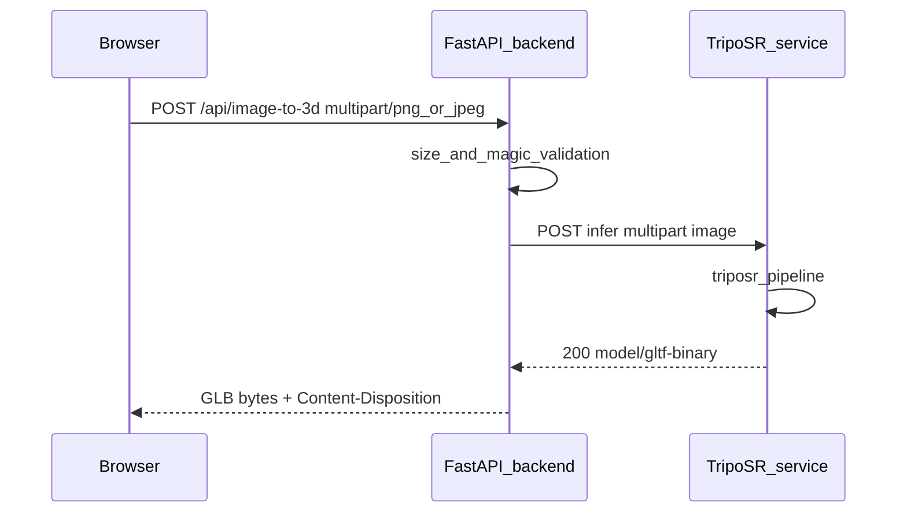

# TripoSR 單步整合（原圖轉 GLB）

## Overview

將 `life-course-from-2d-to-3d` 從「mock 3D + 獨立去背 API + 兩步前端」遷移為 **單步原圖轉 3D**：由 **TripoSR** 產出真實 **GLB**，並依需求移除 **`/api/remove-background`** 與相關 UI／啟動邏輯。本計畫以需求稿為準（見 origin），並假設 **多數請求 < 30 秒** 可維持同步 HTTP。

## Problem Frame

使用者希望在同一專案中完成 **2D→3D**，而非永遠拿到空場景 GLB；產品敘事改為 **一步** 且由 TripoSR 內含之前處理／去背語意，避免與本專案 rembg **雙重去背**。（見 origin：Problem Frame、Key Decisions）

## Requirements Trace

- R1. 單步：上傳原圖 → 取得可預覽／下載的 3D（origin）
- R2. 移除兩步驟主敘事與相關 CTA（origin）
- R3. 首版 UI 不提供 OBJ／GLB 選擇器；預設 GLB（origin）
- R4. `/api/image-to-3d` 回傳真實 TripoSR GLB（origin）
- R5. 移除 `/api/remove-background` 與 rembg lifespan／session（origin）
- R6. 上傳驗證收斂 **PNG + JPEG**（origin）
- R7. 以 `TripoSR-main` 推理路徑為理解參照，不整合 Gradio（origin）
- 成功準則：非空可旋轉預覽、可下載 GLB；無獨立去背 API（origin）

## Scope Boundaries

- 不包含前端 OBJ 預覽或多格式下載。
- 不包含將 `TripoSR-main/gradio_app.py` 嵌入為產品 UI。
- 不於本計畫內規定雲端 GPU 廠商或正式 SLA；僅定義 **本機／開發可驗證** 與 **建議部署形狀**。

## Context & Research

### Relevant Code and Patterns

- 後端路由與 mock：`backend/app/main.py`（`/api/remove-background`、`/api/image-to-3d`、`_make_mock_glb`、`lifespan`）
- 驗證常數與 magic bytes：`backend/app/validation.py`（`ALLOWED_IMAGE_MIME_TYPES` 含 WebP；`ALLOWED_3D_MIME_TYPES` 目前僅 PNG；`detect_image_type`／`detect_png`）
- 前端分頁與流程：`frontend/src/App.jsx`（兩 tab）、`frontend/src/ImageTo3D.jsx`（兩步狀態機）、`frontend/src/api.js`、`frontend/src/validation.js`
- 測試：`backend/tests/test_remove_bg.py`、`backend/tests/test_image_to_3d.py`、`backend/tests/conftest.py`（import 前 mock `rembg`）

### Institutional Learnings

- `docs/solutions/` 目錄於本 repo 不存在；無可引用之內部解法文件。

### External References

- 推理行為與旗標語意以本機參考樹 `TripoSR-main/run.py`、`TripoSR-main/gradio_app.py` 為準（此計畫不嵌入其絕對路徑於交付物；實作者工作區自行對齊）。

**External research 決策：** 不額外呼叫線上框架文件；本整合的風險主要在 **GPU／逾時／程序邊界**，以 repo 內模式與需求稿即可規劃。若實作階段遇到 Torch／CUDA 版本矩陣問題，再針對性查官方文件。

## Key Technical Decisions

- **TripoSR 與 FastAPI 分離行程（建議預設）**：推理服務獨立（sidecar），`life-course` 後端只做驗證、轉發、錯誤映射；避免 rembg 與巨型 torch 堆疊擠在同一個 web 行程。（呼應 origin 之「建議實作拓樸」）
- **同步 HTTP 首版**：在「多數 < 30 秒」假設下維持單次請求；逾時設定與錯誤訊息需與反向代理一致，若實測失敗則啟動 origin 中「非同步 job」議題。
- **輸入驗證**：`image-to-3d` 改為 **PNG + JPEG** 的 magic bytes 偵測；與現有 `read_and_validate_upload` 模式一致。
- **移除 mock GLB**：`_make_mock_glb` 與其測試在真實路徑接通後刪除或改寫（避免雙軌）。

## Grill-me 已定案（2026-04-15）

以下為 `/grill-me` 對本計畫與需求稿之決策收斂，實作時以此為準；若與上文段落衝突，以本節為準。

| 題次 | 議題 | 定案 |
|------|------|------|
| 1 | TripoSR HTTP 服務程式碼位置 | 本 repo `services/triposr-api/`（獨立 Dockerfile） |
| 2 | infer 網路暴露 | 僅內網／compose 網段；公網只經 FastAPI |
| 3 | 無可用 GPU | 快速失敗，不做長時間 CPU 同步推理 |
| 4 | TripoSR 不可用時 `GET /health` | HTTP 200、`status=degraded`、並附明確子欄位（如 `triposr_ok=false`） |
| 5 | 單 GPU 併發 | 服務內序列化（鎖），避免互搶導致不穩 |
| 6 | EXIF Orientation | 於 `triposr-api` 內、送模型前 auto-orient |
| 7 | 轉換 API 路徑 | 維持 `POST /api/image-to-3d`；語意變更以文件／release note 說明 |
| 8 | FastAPI → triposr-api HTTP 逾時 | 預設 **60s**（可環境變數覆寫） |
| 9 | 超過最大邊長 | **等比例縮小**至長邊上限（像素值實作時訂，建議自 2048 起試） |
| 10 | 隱私與 logging | **不落盤**；log 最小化（request id、耗時、狀態等），不記原檔名 |
| 11 | 錯誤追蹤 | `X-Request-Id`（或同等）標頭，且錯誤 `detail` 內含同一段可回報 ID |
| 12 | 近乎空網格 | `triposr-api` 回傳前做幾何門檻檢查，未達門檻視為失敗並回繁中原因 |

## Open Questions

### Resolved During Planning

- **TripoSR 程式碼放哪？** 以 **獨立服務原始碼** 為單位（可為 `TripoSR-main` 的薄包裝 repo、或於 monorepo 新增 `services/triposr-api/`），由 compose 建置；**不**要求將 TripoSR 完整 Python 套件「pip install 進現有 backend 同一 venv」作為唯一解。
- **JPEG 測試 fixtures：** 使用最小合法 JPEG bytes 作為測試上傳（實作單元補上具體位元組來源或 factory）。

### Deferred to Implementation

- TripoSR 服務的 **URL、逾時秒數、重試** 與環境變數命名。
- `mc-resolution`、`chunk-size` 等模型參數是否暴露為環境設定。
- TripoSR 服務內是否固定輸出 **glb**（建議是）與檔名慣例。

## High-Level Technical Design

> *This illustrates the intended approach and is directional guidance for review, not implementation specification. The implementing agent should treat it as context, not code to reproduce.*

## Implementation Units

- [ ] **Unit 1: TripoSR 推理服務最小 HTTP 外殼**

**Goal:** 提供可獨立啟動的行程，接受影像上傳並回傳 **GLB** 位元組。

**Requirements:** R4, R7

**Dependencies:** 無（可與 Unit 2 並行設計，但建議先定契約）

**Files:**

- Create: `services/triposr-api/`（建議新路徑；若團隊選擇留在獨立 repo，則於該 repo 新增對應檔案並在 compose 指向之）
- Test: `services/triposr-api/tests/test_infer_contract.py`（若服務位於本 repo；否則改為該 repo 之對等測試路徑）

**Approach:**

- 定義 **單一 infer 路由**：multipart 影像欄位名稱與成功／失敗 status 對照表（供 FastAPI 映射）。
- 內部呼叫 TripoSR 推理與匯出 **glb**（前處理／去背語意與 `TripoSR-main` 預設對齊，細節實作時再定）。

**Patterns to follow:**

- 與 `TripoSR-main/run.py` 相同的高階步驟（載入 `TSR`、推理、`extract_mesh`、匯出）。

**Test scenarios:**

- Happy path：最小 PNG 上傳 → 200、`Content-Type` 為 `model/gltf-binary`、body 以 GLB magic 開頭。
- Happy path：最小 JPEG 上傳 → 同上。
- Error path：非影像內容 → 4xx。
- Error path：超過大小上限 → 413。

**Verification:**

- 獨立啟動服務後，以 `curl` 或測試 client 可取得非零長度 GLB。

---

- [ ] **Unit 2: FastAPI — 移除 rembg 面、擴充 image-to-3d 驗證、轉發 TripoSR**

**Goal:** `backend` 符合 R4–R6、R5；`/health` 反映新依賴。

**Requirements:** R4, R5, R6

**Dependencies:** Unit 1 的 infer 契約至少草稿級穩定

**Files:**

- Modify: `backend/app/main.py`
- Modify: `backend/app/validation.py`（新增或調整 `ALLOWED_*`、`detect_*` 供 image-to-3d 使用；移除 WebP 於此流程若與 R6 衝突）
- Modify: `backend/pyproject.toml` 或 `backend/requirements.txt`（新增 HTTP client 依賴如 `httpx`，若尚未存在）
- Test: `backend/tests/test_image_to_3d.py`
- Test: `backend/tests/conftest.py`

**Approach:**

- 刪除 `lifespan` 內 `rembg` session、`/api/remove-background` 路由與 `rembg` import。
- `GET /health`：改為檢查 TripoSR 服務 **tcp/http 探活** 或「上次成功初始化」狀態（擇一，實作時具體化）。
- `image-to-3d`：`detect_type` 使用可辨識 PNG／JPEG 的函式；`allowed_types` 僅允許兩者。
- 以非阻塞方式呼叫 TripoSR（`async` client + `run_in_executor` 擇一），將下游 4xx/5xx 映射為使用者可讀 `detail`（繁中與現有風格一致）。
- 刪除 `_make_mock_glb` 與 TODO mock 分支。

**Patterns to follow:**

- 現有 `read_and_validate_upload` 與 `HTTPException` 映射風格。

**Test scenarios:**

- Happy path：PNG／JPEG（magic 正確）→ 200 GLB（以 **mock TripoSR HTTP** 回固定 GLB bytes）。
- Error path：WebP 內容 → 415（若全站同步移除 WebP；與前端一致）。
- Error path：TripoSR 503 → 映射為 502/503 其一（實作選定後測試固定）。
- Integration：validation 與 client 呼叫順序正確（可先 mock URL）。

**Verification:**

- `pytest backend/tests/test_image_to_3d.py` 全數通過；`test_remove_bg` 不再存在或已移除。

---

- [ ] **Unit 3: 測試套件清理 — 移除 remove-background 測試與 rembg import 鈎子**

**Goal:** 測試與 `conftest` 與 R5 一致。

**Requirements:** R5

**Dependencies:** Unit 2 完成大部分刪除後執行較順

**Files:**

- Delete或改寫: `backend/tests/test_remove_bg.py`
- Modify: `backend/tests/conftest.py`

**Approach:**

- 若不再依賴 `rembg`，移除 `sys.modules` patch；若仍需 mock 其他模組，改以 httpx mock 為主。

**Test scenarios:**

- Error path：舊 `/api/remove-background` 路由應回 **404**（若已刪除）。

**Verification:**

- 全 backend `pytest` 綠燈。

---

- [ ] **Unit 4: 前端 — 單頁主流程與驗證收斂**

**Goal:** UI 符合 R1–R3、R6；移除獨立去背 tab 與兩步驟狀態機。

**Requirements:** R1, R2, R3, R6

**Dependencies:** Unit 2 的 API 契約穩定

**Files:**

- Modify: `frontend/src/App.jsx`
- Modify: `frontend/src/ImageTo3D.jsx`
- Modify: `frontend/src/api.js`
- Modify: `frontend/src/validation.js`
- Delete或閒置: `frontend/src/RemoveBg.jsx`（若完全不用則刪除並清引用）

**Approach:**

- `App.jsx`：移除「移除背景」tab，或改為單一路由／單一 view；預設進入即上傳原圖轉 3D。
- `ImageTo3D.jsx`：狀態機收斂為 `idle | converting | done | error`（命名可調）；單一 submit。
- `api.js`：刪除 `removeBackground`；`convertTo3D` 改為接受 png/jpeg `File`。
- `validation.js`：`ALLOWED_TYPES` 移除 `image/webp`，錯誤文案同步。

**Patterns to follow:**

- 既有 `postForBlob`、錯誤訊息中文、`model-viewer` 區塊。

**Test scenarios:**

- Happy path：選 JPEG → 成功取得 blob URL → `model-viewer` 有 `src`。（若專案無前端測試 runner，則標 **Test expectation: none — 以手動 smoke 清單取代**，並於 Verification 寫出手動步驟）

**Verification:**

- 手動：`npm run dev` + 後端 + TripoSR 服務，完成一輪上傳→預覽→下載。

---

- [ ] **Unit 5: 開發者啟動路徑（compose 或 README 節）**

**Goal:** 新開發者可啟動 **backend + triposr-api** 並跑通端到端。

**Requirements:** 成功準則（端到端）

**Dependencies:** Unit 1–2

**Files:**

- Modify: `README.md`（repo 根目錄；若已有啟動說明則增補一節）**或** Create: `docs/` 下之運維說明（與團隊慣例對齊；避免重複兩份）

**Approach:**

- 提供最小 `docker-compose` 片段或明確兩個指令與必要環境變數（**不**寫死絕對路徑）。

**Test scenarios:**

- Test expectation: none — 文件變更，以 reviewer 可執行為準。

**Verification:**

- 另一位開發者照文件可重現 GLB 預覽。

## System-Wide Impact

- **Interaction graph：** 瀏覽器僅依賴 `/api/image-to-3d`；移除 `/api/remove-background` 後，舊書籤或外部客戶端會 **404**（需求允許）。
- **Error propagation：** TripoSR 失敗應有分類（逾時、OOM、無 GPU）；避免將內部 stack trace 回傳給使用者。
- **State lifecycle risks：** 大型 GLB 回應需注意記憶體峰值；實作考慮串流或限制輸出大小（deferred 微調）。
- **API surface parity：** 僅剩單一 3D 轉換入口與 `/health`。
- **Unchanged invariants：** 安全標頭 middleware、CORS 環境變數模式、檔案大小上限（10MB）除非需求另改。

## Risks & Dependencies

| Risk | Mitigation |
|------|------------|
| GPU／Torch 環境難以在本機重現 | 先以 sidecar 容器化；文件標示最低 GPU 記憶體建議 |
| 同步請求逾時（>30s 常態） | 監控實測；必要時啟動非同步設計（見 origin Deferred） |
| WebP 移除造成舊使用者困擾 | 需求已定；於 release note 標示 |

## Documentation / Operational Notes

- `/health` 語意變更需告知任何依賴該欄位的監控（若有）。

## Sources & References

- **Origin document:** [docs/brainstorms/2026-04-15-triposr-integration-requirements.md](docs/brainstorms/2026-04-15-triposr-integration-requirements.md)
- Related code: `backend/app/main.py`, `frontend/src/ImageTo3D.jsx`
- Supersedes product assumptions in: [docs/brainstorms/2026-03-30-rewrite-bg-removal-and-3d-requirements.md](docs/brainstorms/2026-03-30-rewrite-bg-removal-and-3d-requirements.md)
